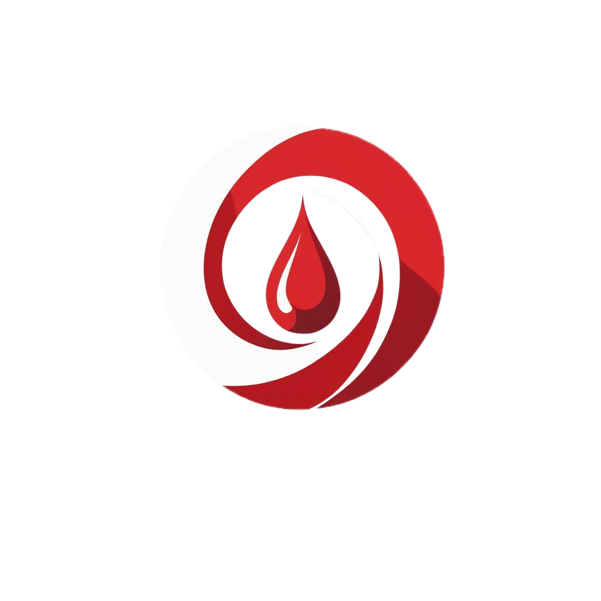

# 🩸 BloodCircle - AI-Powered Blood Donation Management System



**BloodCircle** is a comprehensive, AI-powered blood donation management platform that connects blood donors, hospitals, and blood banks through intelligent matching algorithms and real-time communication. The platform streamlines the entire blood donation process from registration to delivery, while providing valuable health services to donors.

## 🌟 Features

### 🏥 **For Hospitals**
- **Emergency Blood Requests** - Quick blood request system with urgency levels
- **Smart Donor Matching** - AI-powered algorithm finds compatible donors by blood type and location
- **Hospital Dashboard** - Real-time inventory management and request tracking
- **Registration & Authentication** - Secure hospital onboarding system

### 🩸 **For Donors**
- **Easy Registration** - Simple donor registration with availability toggle
- **Blood Request Notifications** - Real-time alerts for matching blood requests
- **Flexible Response System** - Accept/decline requests with detailed information
- **Complimentary Health Services** - Free medical tests and wellness sessions
- **Flexible Donation Options** - Choose between center visits or home pickup

### 🤖 **AI-Powered Features**
- **Intelligent Matching** - Machine learning model for optimal donor-hospital pairing
- **Predictive Analytics** - Dashboard with donation trends and demand forecasting
- **Education Bot** - AI chatbot for blood donation education and guidance
- **Smart Logistics** - Optimized routing for pickup and delivery services

### 📱 **Communication**
- **SMS Notifications** - Twilio integration for instant donor alerts
- **Real-time Updates** - Live status tracking for all stakeholders
- **Multi-channel Support** - Web platform with mobile-responsive design

## 🛠️ Tech Stack

### **Frontend**
- **React.js** - Modern UI library with hooks
- **React Router** - Client-side routing
- **Tailwind CSS** - Utility-first CSS framework
- **Recharts** - Data visualization for analytics
- **Lucide React** - Beautiful icons and components

### **Backend**
- **Node.js** - JavaScript runtime
- **Express.js** - Web application framework
- **MongoDB** - NoSQL database
- **Mongoose** - MongoDB object modeling
- **Twilio** - SMS communication service

### **AI/ML**
- **Scikit-learn** - Machine learning model (blood_donor_model.pkl)
- **Python** - Data science and ML backend
- **Predictive Analytics** - Donor availability and demand forecasting

## 📁 Project Structure

```
nexGenHackProject/
├── frontend/                   # React.js Frontend
│   ├── src/
│   │   ├── components/        # Reusable UI components
│   │   │   ├── Navbar.jsx
│   │   │   ├── Footer.jsx
│   │   │   ├── Hero.jsx
│   │   │   ├── Stats.jsx
│   │   │   ├── Ecosystem.jsx
│   │   │   ├── HowItWorks.jsx
│   │   │   └── Navigation.jsx
│   │   ├── pages/             # Main application pages
│   │   │   ├── Home.jsx
│   │   │   ├── DonorRegistration.jsx
│   │   │   ├── HospitalRequest.jsx
│   │   │   ├── DonorResponse.jsx
│   │   │   ├── DonorConfirmation.jsx
│   │   │   ├── Dashboard.jsx
│   │   │   ├── EducationBot.jsx
│   │   │   ├── HospitalRegistration.jsx
│   │   │   └── HospitalDashBoard.jsx
│   │   ├── utils/             # Utility functions
│   │   │   └── hospitalCredential.jsx
│   │   └── App.jsx            # Main app component
│   └── public/                # Static assets
├── backend/                   # Node.js/Express Backend
│   ├── models/               # Database schemas
│   │   ├── donar.js
│   │   └── hospital.js
│   ├── routes/               # API endpoints
│   │   ├── admin.js
│   │   ├── donar.js
│   │   └── hospital.js
│   ├── utils/                # Backend utilities
│   │   └── twilioConfig.js
│   ├── app.js                # Main server file
│   └── package.json
├── blood_donor_model.pkl     # Trained ML model
└── README.md
```

## 🚀 Getting Started

### **Prerequisites**
- Node.js (v16 or higher)
- MongoDB (local or Atlas)
- Python (for ML model)
- Twilio Account (for SMS)

### **Installation**

1. **Clone the repository**
   ```bash
   git clone https://github.com/yourusername/nexGenHackProject.git
   cd nexGenHackProject
   ```

2. **Backend Setup**
   ```bash
   cd backend
   npm install
   ```

3. **Frontend Setup**
   ```bash
   cd frontend
   npm install
   ```

4. **Environment Variables**
   
   Create `.env` file in backend directory:
   ```env
   MONGODB_URI=mongodb://localhost:27017/bloodcircle
   TWILIO_ACCOUNT_SID=your_twilio_sid
   TWILIO_AUTH_TOKEN=your_twilio_token
   TWILIO_PHONE_NUMBER=your_twilio_phone
   PORT=5000
   ```

5. **Start the Application**
   
   **Backend:**
   ```bash
   cd backend
   npm start
   ```
   
   **Frontend:**
   ```bash
   cd frontend
   npm start
   ```

6. **Access the Application**
   - Frontend: http://localhost:3000
   - Backend API: http://localhost:5000

## 📊 API Endpoints

### **Hospital Routes** (`/hospital`)
- `POST /hospital/newHospital` - Register new hospital
- `POST /hospital/hospitalLogin` - Hospital authentication
- `POST /hospital/requestForBlood` - Create blood request
- `GET /hospital/giveHospital/:id` - Get hospital details

### **Donor Routes** (`/donar`)
- `POST /donar/newDonar` - Register new donor

### **Admin Routes** (`/admin`)
- `GET /admin/hii` - Health check endpoint

## 🎯 Key Features Walkthrough

### **1. Smart Donor Matching**
When a hospital makes a blood request, the system:
- Finds donors with matching blood type
- Filters by location proximity
- Checks donor availability status
- Sends SMS notifications to eligible donors

### **2. Donor Response System**
Donors can:
- View detailed request information
- Accept or decline requests
- Choose donation method (center visit or home pickup)
- Select complimentary health services

### **3. Health Service Rewards**
Donors who accept requests get:
- **Free Medical Tests**: CBC, Blood Sugar, HbA1c, Widal, Lipid Profile, Liver Function
- **Wellness Services**: Guided Meditation, Therapeutic Massage, Counseling, Yoga
- **Transportation**: Optional free cab service for center donations

### **4. AI Dashboard**
Real-time analytics showing:
- Blood inventory levels
- Donation trends and patterns
- Demand forecasting
- Donor availability statistics

## 🧠 Machine Learning Model

The system includes a trained ML model (`blood_donor_model.pkl`) that:
- Predicts donor availability based on historical data
- Optimizes donor-hospital matching
- Forecasts blood demand patterns
- Improves response time efficiency

## 🔧 Development Status

### **✅ Completed Features**
- Full donor and hospital registration
- Blood request and response system
- Real-time donor matching
- Responsive web interface
- SMS notification setup
- AI dashboard with charts
- Complimentary service selection

### **🚧 In Progress**
- OpenAI chatbot integration
- Advanced ML model deployment
- Mobile app development
- Payment gateway integration

### **📋 Planned Features**
- GPS-based location services
- Multi-language support
- Advanced reporting system
- Integration with hospital management systems

## 🤝 Contributing

1. Fork the repository
2. Create your feature branch (`git checkout -b feature/AmazingFeature`)
3. Commit your changes (`git commit -m 'Add some AmazingFeature'`)
4. Push to the branch (`git push origin feature/AmazingFeature`)
5. Open a Pull Request

## 📝 License

This project is licensed under the MIT License - see the [LICENSE](LICENSE) file for details.

## 👥 Team

- **Frontend Development**: React.js, Tailwind CSS, UI/UX Design
- **Backend Development**: Node.js, Express.js, MongoDB
- **AI/ML Development**: Python, Scikit-learn, Predictive Analytics
- **DevOps**: Deployment, CI/CD, Cloud Infrastructure

## 📞 Support

For support, email support@bloodcircle.com or join our Slack channel.

## 🙏 Acknowledgments

- Thanks to all blood donors who make this platform meaningful
- Healthcare professionals who provided domain expertise
- Open source community for amazing tools and libraries

---

**BloodCircle** - *Connecting Lives Through Technology* 🩸❤️

*Built with ❤️ for saving lives through efficient blood donation management*
